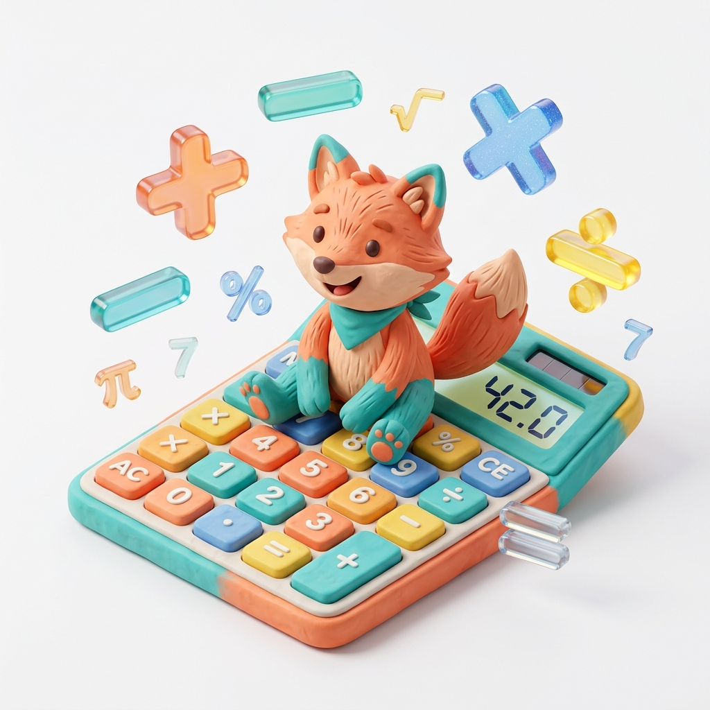
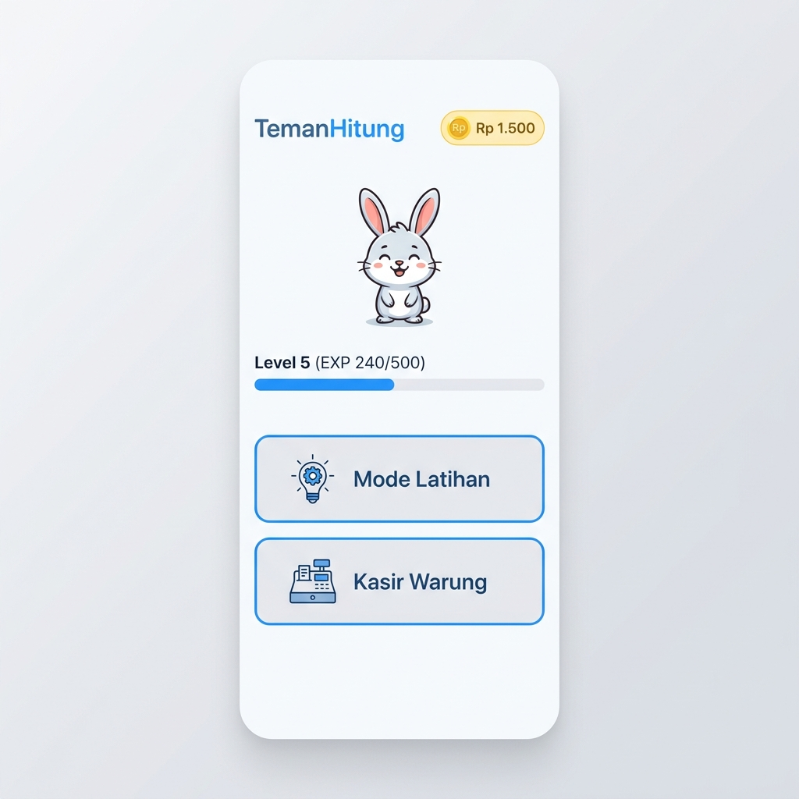
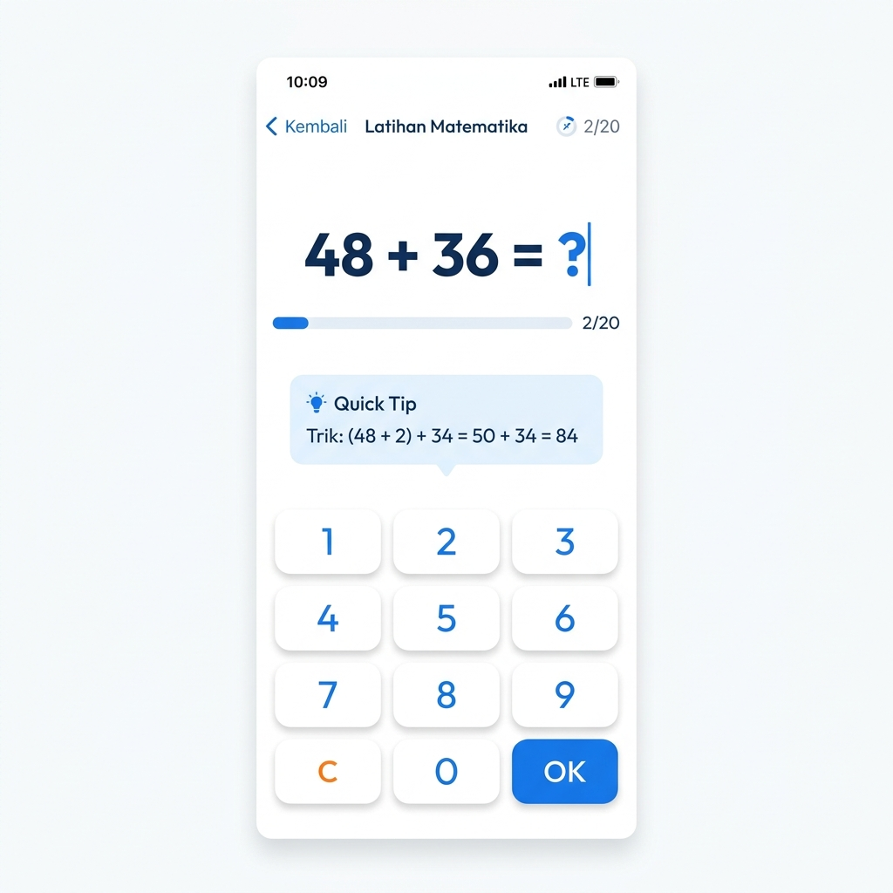
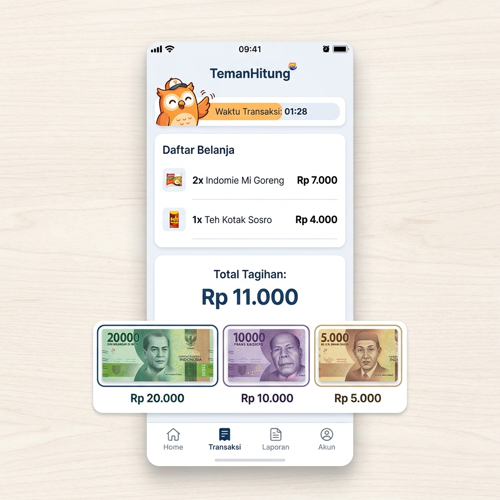

# 🧮 TemanHitung — Mental Math Training App

<p align="center">
  
</p>

<p align="center">
  <strong>Fun math training for all ages — featuring an RPG style, learning companion pets, and a traditional Indonesian grocery store ("warung") cashier simulation!</strong>
</p>

<p align="center">
  
  
  
  
  
</p>

---

## 📸 Screenshots

<p align="center">
  
  &nbsp;&nbsp;&nbsp;&nbsp;
  
  &nbsp;&nbsp;&nbsp;&nbsp;
  
</p>

---

## 📖 About the App

**TemanHitung** (translates to "Counting Buddy") is a mobile-friendly mental math training application designed specifically to make learning fun. Sporting a vibrant RPG/fantasy game style, practicing mathematics feels like playing a game rather than doing boring homework.

This app is perfect for:
- 🧒 **Children** who are learning to count and calculate
- 👩‍👧 **Parents** looking to accompany and support their children's learning journey
- 🏪 **Shopkeepers / Cashiers** wanting to sharpen their quick math skills
- 🧠 **Anyone** looking to keep their mind sharp with daily calculation exercises

---

## ✨ Key Features

### 🎯 Practice Mode
Practice 4 basic math operations with 3 levels of difficulty:

| Operation | Easy | Medium | Hard |
|---|---|---|---|
| ➕ Addition | Small numbers | Medium numbers | Large numbers |
| ➖ Subtraction | Integers | Integers | Integers / Decimals |
| ✖️ Multiplication | Single digit | Two digits | Complex two digits |
| ➗ Division | Single digit | Two digits | Complex two digits |

### 🏪 Warung Cashier Mode
Simulate being a cashier at a traditional Indonesian kelontong store:
- Calculate the **total purchase amount** of multiple items with varying prices
- Calculate the correct **change due** for the customer
- Customers pay with realistic Indonesian Rupiah banknotes (Rp1,000 – Rp100,000)
- Face additional challenges with **discount vouchers** (coupons)
- Watch out! **Customer patience** runs out if you take too long — serve them quickly for bonus coins!

### 🐾 Companion Pet System
Adopt a virtual pet to accompany you on your learning journey:
- 🐱 **Kiko** — The Brave Cat
- 🐹 **Hami** — The Hardworking Hamster
- 🐰 **Mochi** — The Cheerful Rabbit
- 🦊 **Kiba** — The Clever Fox
- 🐦 **Piko** — The Enthusiastic Bird
- 🐒 **Momo** — The Playful Monkey

Pets earn **EXP** with every training session, level up, and can be customized with items purchased using your earned coins in the **Warung Coin Shop**.

### 💡 Quick Math Tips
Every question comes with strategic calculation tips — teaching you the logic without spoiling the final answer. For example:
- Rounding to the nearest tens technique
- Multiplication ×5 trick (multiply by 10, then divide by 2)
- Multiplication ×9 trick (multiply by 10, then subtract the number once)
- Splitting tens and units separately

### ⚙️ Feature-Rich Settings
- 🌙 Light / Dark / System theme support
- ⏱️ Question timer settings (15 / 30 / 60 seconds / untimed)
- 📳 Haptic feedback
- 🔊 Sound effects
- 🌏 Multi-language support (Indonesian & English)
- 📊 Detailed accuracy statistics by operation & difficulty level
- 📈 Score history graph showing your performance over the last 10 sessions

---

## 🛠️ Tech Stack

| Technology | Purpose |
|---|---|
| [React 18](https://react.dev) + [TypeScript](https://typescriptlang.org) | UI framework & type safety |
| [Vite 5](https://vitejs.dev) | Build tool & dev server |
| [Tailwind CSS 3](https://tailwindcss.com) | Styling |
| [Framer Motion 11](https://www.framer.com/motion/) | Animations & page transitions |
| [Capacitor 5](https://capacitorjs.com) | Native Android wrapper |
| [Lucide React](https://lucide.dev) | Icon library |
| [@capacitor/haptics](https://capacitorjs.com/docs/apis/haptics) | Haptic feedback |
| [@capacitor/preferences](https://capacitorjs.com/docs/apis/preferences) | Persistent local storage |

---

## 🚀 Running Locally

### Prerequisites
- Node.js ≥ 18
- npm

### Installation Steps

```bash
# 1. Clone the repository
git clone https://github.com/username/TemanHitung.git
cd TemanHitung

# 2. Install dependencies
npm install

# 3. Start the development server
npm run dev
```

Open your browser and navigate to `http://localhost:5173`

---

## 📱 Building for Android

### Additional Prerequisites
- Java 17 (JDK)
- Android Studio with Android SDK API 24+
- Android device (USB Debugging enabled) or emulator

### Build Steps

```bash
# 1. Build the web application
npm run build

# 2. Sync with Capacitor
npm run cap:sync

# 3. Open in Android Studio
npm run cap:open
```

In Android Studio: Go to **Build → Build Bundle(s) / APK(s) → Build APK(s)**

#### Build APK via CLI (Windows):
```powershell
cd android
.\gradlew.bat assembleDebug
```

The APK will be generated at: `android/app/build/outputs/apk/debug/app-debug.apk`

#### Run directly on your connected device:
```bash
npm run cap:run
```

---

## 📂 Project Structure

```
TemanHitung/
├── src/
│   ├── components/       # UI Components (GameBoard, WarungBoard, MainMenu, etc.)
│   ├── hooks/            # Custom Hooks (useSessionReducer, useSettings, usePet, etc.)
│   ├── i18n/             # Localization files (id.ts, en.ts)
│   ├── types/            # TypeScript type definitions
│   └── utils/            # Utility functions (mathEngine, etc.)
├── android/              # Native Android project (Capacitor)
├── assets/               # Image & icon assets
└── public/               # Static files
```

---

## 🤝 Contributing

Contributions are welcome! Please follow these steps:
1. Fork this repository
2. Create your feature branch (`git checkout -b feature/amazing-feature`)
3. Commit your changes (`git commit -m 'Add some amazing feature'`)
4. Push to the branch (`git push origin feature/amazing-feature`)
5. Open a Pull Request

---

## 📄 License

This project was built for educational and learning purposes. Feel free to use, modify, and distribute it.

---

<p align="center">
  Made with ❤️ to make learning math more fun 🧮
</p>
